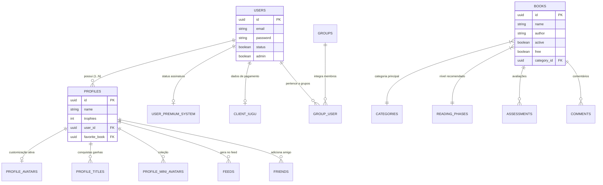
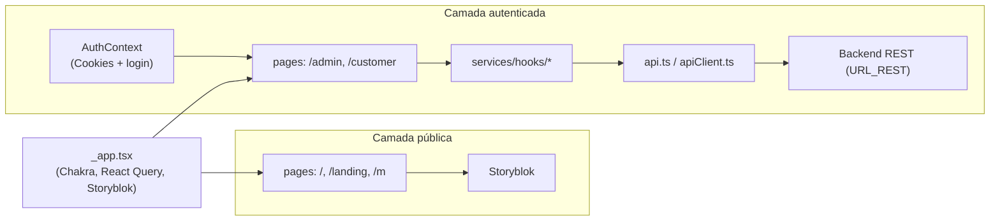

<div align="center">
  
  <br /><br />
  
  <br /><br />
  <p><em>Plataforma de leitura e interação social para o público familiar e infantil</em></p>
  <br />

  [](https://github.com/tecteca-app/api-node)
  [](https://github.com/EugTec/front-next)
  [](https://github.com/tecteca-app/mobile)
  [](#)
  [](#)
  [](#)
</div>

---

# Documentação Completa — Tecteca

Visão consolidada dos três repositórios que compõem a plataforma Tecteca.

| Repositório | GitHub | Pasta local |
| --- | --- | --- |
| **api** | https://github.com/tecteca-app/api-node | `api/` |
| **dash** | https://github.com/EugTec/front-next | `dash/` |
| **mobile** | https://github.com/tecteca-app/mobile | `mobile/` |

### URLs de produção

| Serviço | URL | Porta local |
| :--- | :--- | :--- |
| **API** | https://api.tecteca.com.br | `3001` |
| **Dashboard** | *(configurar `URL_REST` no deploy)* | `3000` |
| **App Android** | Google Play Store | `8081` (Metro) |
| **App iOS** | App Store / TestFlight | `8081` (Metro) |

---

## Índice

1. [Visão Geral da Plataforma](#1-visão-geral-da-plataforma)
2. [API — Backend Node.js](#2-api--backend-nodejs)
   - [Tecnologias](#21-tecnologias)
   - [Arquitetura](#22-arquitetura)
   - [Banco de Dados](#23-banco-de-dados)
   - [Como Rodar](#24-como-rodar)
   - [Deploy e CI/CD](#25-deploy-e-cicd)
   - [Operações Comuns](#26-operações-comuns)
3. [Dash — Dashboard Web (Next.js)](#3-dash--dashboard-web-nextjs)
   - [Tecnologias](#31-tecnologias)
   - [Arquitetura](#32-arquitetura)
   - [Perfis de Uso e Telas](#33-perfis-de-uso-e-telas)
   - [Como Rodar](#34-como-rodar)
   - [Deploy](#35-deploy)
4. [Mobile — Aplicativo React Native](#4-mobile--aplicativo-react-native)
   - [Tecnologias](#41-tecnologias)
   - [Arquitetura](#42-arquitetura)
   - [Principais Telas](#43-principais-telas)
   - [Como Rodar](#44-como-rodar)
   - [Build e Deploy](#45-build-e-deploy)
   - [Operações Comuns](#46-operações-comuns)

---

## 1. Visão Geral da Plataforma

A Tecteca é uma plataforma de leitura e interação social voltada ao público familiar e infantil. A arquitetura é composta por três camadas independentes que se comunicam via REST:

```text
┌─────────────────────┐     REST      ┌──────────────────────┐
│  Mobile (React Native)│ ──────────► │                      │
└─────────────────────┘              │   API (Node.js /      │
                                     │   PostgreSQL / Redis) │
┌─────────────────────┐     REST     │                      │
│  Dash (Next.js)     │ ──────────► │                      │
└─────────────────────┘              └──────────────────────┘
```

- O **mobile** é o produto principal consumido pelas famílias.
- O **dash** é o painel web para clientes e administradores.
- A **API** é o motor central: regras de negócio, persistência, integrações de pagamento e armazenamento de arquivos.

---

## 2. API — Backend Node.js

> Repositório: https://github.com/tecteca-app/api-node  
> Documentação local: [`api/README.md`](api/README.md)

### 2.1 Tecnologias

| Categoria | Tecnologia |
| :--- | :--- |
| Linguagem | TypeScript |
| Runtime | Node.js (v14+) |
| Framework Web | Express |
| ORM | TypeORM (PostgreSQL) |
| Cache / Rate Limit | Redis |
| Injeção de dependência | TSyringe |
| Validação | Celebrate (Joi) |
| Testes | Jest |
| Documentação API | Swagger |
| Containerização | Docker + Docker Compose |

### 2.2 Arquitetura

O projeto segue **Clean Architecture** e **DDD (Domain-Driven Design)** adaptados para Node.js.

#### Estrutura de pastas (`src/`)

```text
src/
├── modules/          Domínios de negócio (accounts, books, profiles, …)
│   ├── dtos/         Data Transfer Objects (tipagem de entrada)
│   ├── infra/
│   │   └── typeORM/
│   │       └── entities/   Modelos mapeados para tabelas do banco
│   ├── repositories/ Interfaces e implementações de acesso a dados
│   ├── useCases/     Lógica de negócio (um UseCase por funcionalidade)
│   └── views/        Templates de e-mail (Handlebars)
└── shared/
    ├── container/    Configuração do TSyringe (Dependency Injection)
    ├── errors/       Tratamento global de exceções
    └── infra/
        ├── http/     Express: rotas, middlewares e servidor
        └── typeORM/  Migrações globais e conexão com o banco
```

#### Fluxo de uma requisição

```text
HTTP Request
  → Routes (shared/infra/http/routes)
  → Controller (modules/<modulo>/useCases/<UseCase>/Controller.ts)
  → UseCase (regras de negócio)
  → Repository (acesso ao banco via TypeORM)
  → Resposta HTTP
```

#### Padrões aplicados

- **Dependency Injection** com TSyringe: repositórios são injetados nos use cases, facilitando mocks em testes.
- **SOLID**: responsabilidade única por UseCase, inversão de dependência via interfaces de repositório.
- **Migrations**: controle de versão do banco via TypeORM. Nunca altere uma migration já publicada; crie uma nova.

### 2.3 Banco de Dados

Banco relacional **PostgreSQL** + cache **Redis**.

#### Diagrama de entidades (simplificado)



#### Tabelas principais

**`users`** — Pilar de acesso do sistema  
`id` · `name` · `email` · `password` (bcrypt) · `status` · `is_email` · `admin` · `type`

**`profiles`** — Perfis de uso (múltiplos por usuário, ex: um por filho)  
`id` · `user_id` (FK) · `name` · `birth_date` · `trophies` · `favorite_book` (FK) · `avatar_id_number`

**`books`** — Catálogo de conteúdo  
`id` · `name` · `author` · `illustrator` · `cover` / `mini_cover` (S3) · `book_link` / `epub_link` (S3) · `free` · `active` · `category_id` (FK) · `reading_phase_id` (FK)

#### Outros módulos do banco

| Grupo | Tabelas |
| :--- | :--- |
| Customização visual | `profile_avatars`, `profile_avatar_accessories`, `titles`, `profile_titles`, `mini_avatars` |
| Grupos / Instituições | `groups`, `group_user` |
| Assinaturas financeiras | `user_premium_system`, `cliente_iugu`, `cliente_apple` |
| Governança | `logs`, `user_blok_book`, `profile_blok_category`, `group_blok_reading_phase` |

#### Comandos de migração

```bash
# Aplicar migrações pendentes
yarn typeorm migration:run

# Reverter a última migração
yarn typeorm migration:revert

# Criar arquivo de nova migração vazio
yarn typeorm migration:create -n NomeDaMigracao
```

> ⚠️ Uma migração publicada em produção **nunca deve ser editada**. Crie uma nova para corrigir qualquer problema.

### 2.4 Como Rodar

#### Pré-requisitos

- Node.js v14+
- Yarn ou NPM
- Docker + Docker Compose (opcional)
- PostgreSQL e Redis (se não usar Docker)

#### Configuração do ambiente

```bash
cp .env.example .env
# Preencha as variáveis principais:
# DATABASE_URL, SECRET_TOKEN, AWS_ACCESS_KEY_ID, AWS_SECRET_ACCESS_KEY, PORT (padrão: 3001)
```

#### Múltiplos ambientes

Crie arquivos separados baseados no `.env.example`:

```bash
cp .env.example .env.dev    # desenvolvimento / homologação
cp .env.example .env.prod   # espelho de produção
```

#### Iniciar a aplicação

```bash
# Instalar dependências
yarn install

# Rodar em desenvolvimento (com .env.dev)
npx dotenv -e .env.dev -- yarn dev

# Executar migrações
yarn typeorm migration:run
```

#### Usando Docker

```bash
# Sobe API + PostgreSQL + Redis em background
docker-compose up -d
```

#### Testes

```bash
yarn test           # todos os testes
yarn test:cov       # com cobertura
yarn test:watch     # modo watch
```

O servidor estará disponível em `http://localhost:3001`.

### 2.5 Deploy e CI/CD

O deploy é automatizado via **GitHub Actions** ao fazer push na branch `master`.

#### Pipeline (`.github/workflows/ci.yml`)

| Etapa | O que acontece |
| :--- | :--- |
| **Build** | Ubuntu + Node.js 16, instala deps, transpila TypeScript |
| **Transferência** | Envia arquivos ao servidor via SSH (`ssh-deploy`), sem `node_modules` |
| **Execução** | No servidor: `yarn install` → `migration:run` → `pm2 restart all` → `pm2 save` |

#### GitHub Secrets necessárias

| Secret | Descrição |
| :--- | :--- |
| `SSH_PRIVATE_KEY` | Chave privada SSH para acesso ao servidor |
| `REMOTE_HOST` | IP ou hostname do servidor |
| `REMOTE_USER` | Usuário SSH (ex: `ubuntu`) |
| `REMOTE_PORT` | Porta SSH (padrão: `22`) |

#### Gerenciamento em produção com PM2

```bash
pm2 status        # status dos processos
pm2 logs          # logs em tempo real
pm2 restart all   # reiniciar manualmente
```

### 2.6 Operações Comuns

#### Alterar senha (usuário autenticado)

```http
PUT /user/:id
Authorization: Bearer <token>

{ "password": "senha_atual", "newPassword": "nova_senha" }
```

#### Recuperação de senha (2 passos)

```http
# Passo 1 — solicitar e-mail de recuperação
POST /password/forgot
{ "email": "usuario@exemplo.com" }

# Passo 2 — definir nova senha com o token recebido por e-mail
POST /password/reset?token=TOKEN
{ "password": "nova_senha" }
```

#### Gerenciar perfis

```http
POST   /profile                    # criar novo perfil
PUT    /profile/:profile_id        # editar perfil
DELETE /profile/:profile_id        # excluir perfil (e dados vinculados)
```

#### Operações administrativas

```http
# Excluir usuário (apenas admins)
DELETE /user/:user_id/admin
Authorization: Bearer <admin_token>

# Forçar redefinição de senha de outro usuário (apenas admins)
PUT /user/:user_id/admin
Authorization: Bearer <admin_token>
{ "newPassword": "nova_senha" }
```

---

## 3. Dash — Dashboard Web (Next.js)

> Repositório: https://github.com/EugTec/front-next  
> Documentação local: [`dash/README.md`](dash/README.md)

### 3.1 Tecnologias

| Categoria | Tecnologia |
| :--- | :--- |
| Framework | Next.js 12 (Pages Router) |
| UI | React 18 + Chakra UI |
| Fetch / Cache | React Query + Axios |
| CMS público | Storyblok |
| Linguagem | TypeScript |

### 3.2 Arquitetura

A aplicação tem dois fluxos principais:

- **Fluxo transacional / administrativo**: consome o backend REST via Axios.
- **Fluxo de páginas públicas**: consome conteúdo do Storyblok (CMS headless).



#### Estrutura de pastas (`src/`)

```text
src/
├── components/   UI compartilhada: Layout, modais, formulários, tabelas
├── contexts/     Contextos globais: AuthContext, SidebarDrawerContext
├── hooks/        Hooks auxiliares (autorização, etc.)
├── interfaces/   Tipagens e contratos de domínio
├── pages/        Rotas do Next.js (agrupadas por contexto)
├── services/     Axios client, hooks React Query por domínio, tratamento de erros
├── storyblok/    Componentes para renderizar blocos do CMS
├── styles/       Tema Chakra UI e tokens visuais
└── utils/        Guardas SSR (withSSRAuth / withSSRGuest), helpers
```

#### Camadas principais

**`components`** — UI compartilhada  
`Layout.tsx` (admin com Header + Sidebar) · `LayoutCustomer.tsx` (área cliente sem sidebar) · `ModalUpdate/` · inputs e selects padronizados.

**`contexts`** — Estado global  
`AuthContext.tsx` — login, persistência de sessão e redirecionamento  
`SidebarDrawerContext.tsx` — estado de abertura da navegação lateral.

**`services`** — Acesso a dados  
`api.ts` — cliente Axios com `baseURL = URL_REST`  
`apiClient.ts` — tratamento de 401, refresh token e reenvio da requisição original  
`hooks/` — hooks React Query por domínio: `user`, `book`, `subscriptions`, `plans`, `groups`, `feed`, `avatar`.

### 3.3 Perfis de Uso e Telas

#### Perfis

| Perfil | Acesso |
| :--- | :--- |
| **Público** | Páginas institucionais e landing pages |
| **Cliente** | Conta, perfis, assinatura e atividades |
| **Admin** | Operação completa: usuários, livros, assinaturas, grupos, feed, parceiros, exportações |

#### Mapa de rotas

| Rota | Quem usa | Objetivo |
| :--- | :--- | :--- |
| `/` | público | home institucional (Storyblok) |
| `/landing` | público | landing page |
| `/signIn` | público | login |
| `/new-account` | público | cadastro |
| `/reset-forgot` | público | solicitar recuperação de senha |
| `/reset-password` / `/password/reset` | público | definir nova senha com token |
| `/customer` | cliente | dashboard: conta, perfis, plano, atividades |
| `/customer/new-plan` | cliente | contratação de assinatura (boleto / Pix) |
| `/admin` | admin | indicadores e gráficos |
| `/admin/users` | admin | lista e busca de clientes |
| `/admin/users/[id]` | admin | detalhe do cliente + ações administrativas |
| `/admin/books` | admin | catálogo de livros |
| `/admin/subscriptions` | admin | acompanhamento de assinaturas Iugu |
| `/admin/groups` | admin | gestão de grupos |
| `/admin/feed` | admin | gestão de feed |
| `/admin/partners` | admin | gestão de parceiros |
| `/admin/export` | admin | exportação de dados |

#### Telas críticas para operação

- `/admin/users` e `/admin/users/[id]` — suporte e manutenção de clientes, reset de senha pelo admin.
- `/admin/books` — manutenção do catálogo.
- `/admin/subscriptions` — análise de assinaturas.
- `/customer/new-plan` — jornada de conversão e cobrança.

### 3.4 Como Rodar

#### Pré-requisitos

- Node.js 18
- Yarn 1.22.x

#### Configuração

```bash
# Crie o arquivo de variáveis de ambiente
echo "URL_REST=https://api.tecteca.com.br" > .env.local

# Instale as dependências
yarn install

# Suba em modo desenvolvimento
yarn dev
```

A aplicação estará disponível em `http://localhost:3000`.

### 3.5 Deploy

#### Build de produção

```bash
yarn install --frozen-lockfile
yarn build
yarn start
```

#### Variável obrigatória

```env
URL_REST=https://seu-backend.exemplo.com
```

Sem `URL_REST` as telas autenticadas e integrações de negócio não funcionam.

#### Smoke test mínimo pós-deploy

- `/` abre normalmente.
- `/signIn` carrega sem erro de JavaScript.
- Login autentica e redireciona para `/admin` ou `/customer`.
- `/customer/new-plan` consegue iniciar a jornada de assinatura.
- `/admin` carrega o dashboard.
- `/reset-forgot` aceita um e-mail e chama o backend.

#### Estratégias de deploy

**Plataforma gerenciada** (Vercel, Railway, etc.):  
Defina `URL_REST` nas variáveis do projeto e configure o comando de build como `yarn build`.

**Servidor Node.js próprio**:

```bash
yarn install --frozen-lockfile
yarn build
yarn start
# Mantenha o processo com PM2, systemd ou equivalente
```

---

## 4. Mobile — Aplicativo React Native

<div align="center">
  
</div>

> Repositório: https://github.com/tecteca-app/mobile  
> Documentação local: [`mobile/README.md`](mobile/README.md)

### 4.1 Tecnologias

| Categoria | Tecnologia |
| :--- | :--- |
| Framework | React Native `v0.81.1` + TypeScript |
| Roteamento | React Navigation `v7` |
| Estado global | Zustand |
| Cache de API | TanStack React Query `v5` |
| Estilização | NativeWind (TailwindCSS) + Styled Components |
| Storage rápido | React Native MMKV |
| HTTP | Axios |
| Formulários | React Hook Form + Yup |
| Animações | React Native Reanimated + Moti |

### 4.2 Arquitetura

O app é estruturado de forma modular e escalável dentro da pasta `src/`:

```text
src/
├── assets/       Imagens, ícones e fontes customizadas
├── components/   Componentes reutilizáveis de UI (Botões, Cards, Inputs)
├── interfaces/   Tipagens TypeScript compartilhadas (modelos de domínio, respostas da API)
├── routes/       React Navigation: Stacks, Tabs e tipagem das rotas
├── screens/      Páginas / Views principais do aplicativo
├── services/     Configuração do Axios e abstrações de requisições à API
├── stores/       Estado global com Zustand
└── utils/        Funções utilitárias, formatadores, máscaras, constantes
```

#### Decisões arquiteturais

| Área | Decisão |
| :--- | :--- |
| **Estado global** | Zustand (simples, sem verbosidade do Redux) |
| **Cache assíncrono** | TanStack React Query (gestão de dados do servidor) |
| **Requisições** | Axios centralizado em `src/services`; tokens via interceptors (MMKV) |
| **Formulários** | React Hook Form + Yup (menor número de re-renders) |
| **Estilização** | NativeWind para classes Tailwind; Styled Components para customizações pontuais |
| **Animações** | Moti + Reanimated (rodam diretamente na thread de UI, sem gargalos) |
| **Storage** | MMKV (síncrono e rápido para tokens e configurações) |

### 4.3 Principais Telas

#### Autenticação e perfis

| Tela | Função |
| :--- | :--- |
| `Sign / Auth` | Login e cadastro |
| `ResetPassword / ConfirmEmail` | Recuperação de senha por e-mail |
| `AccountSelect` | Seleção do perfil (estilo streaming) |
| `ProfileCreate / AvatarEdit` | Criação e personalização de perfil |

#### Descoberta de conteúdo

| Tela | Função |
| :--- | :--- |
| `Home` | Dashboard principal: destaques, recomendações, progresso |
| `Books / Category` | Exploração do acervo por categorias |
| `Search` | Busca por título, autor ou tema |

#### Leitura e interação

| Tela | Função |
| :--- | :--- |
| `Book` | Detalhes do livro (sinopse, capa, informações) |
| `ReadBook / ReadBookLink` | Leitor de livros (conteúdo interativo ou WebView) |
| `CommentBook` | Avaliações e comentários da comunidade |

#### Social e comunidade

| Tela | Função |
| :--- | :--- |
| `Friend / SearchFriend` | Adicionar amigos e ver atividades de leitura |
| `Profile` | Histórico, livros favoritos, amigos e avatar |

#### Configurações e financeiro

| Tela | Função |
| :--- | :--- |
| `Setting / Account` | Preferências, notificações e dados da conta |
| `Payment / LockResources` | Gestão de assinatura e bloqueio de conteúdo premium |

### 4.4 Como Rodar

#### Pré-requisitos

- Node.js 20+
- Yarn
- JDK (para Android)
- Android Studio com SDK e emulador configurados
- Xcode + CocoaPods (apenas macOS, para iOS)

#### Instalação

```bash
yarn install

# iOS (apenas macOS)
cd ios && pod install && cd ..
```

#### Configuração da URL da API

Edite `src/services/api.ts`:

```ts
const api = axios.create({
  // baseURL: 'https://api-dev.tecteca.com.br', // desenvolvimento
  baseURL: 'https://api.tecteca.com.br',        // produção
});
```

#### Executar no Android

```bash
yarn start        # inicia o Metro Bundler
yarn android      # em outro terminal
```

#### Executar no iOS (macOS)

```bash
yarn start
yarn ios
```

### 4.5 Build e Deploy

#### Android

```bash
cd android

# App Bundle para Google Play (recomendado)
./gradlew bundleRelease
# Saída: android/app/build/outputs/bundle/release/app-release.aab

# APK padrão para distribuição externa / testes
./gradlew assembleRelease
# Saída: android/app/build/outputs/apk/release/app-release.apk
```

Antes do build, configure o arquivo `keystore.properties` (copie de `keystore.properties.exemple`) com as credenciais do seu certificado `.keystore`.

#### iOS (macOS)

1. Instale pods: `cd ios && pod install`.
2. Abra `Tecteca.xcworkspace` no Xcode.
3. Em **Signing & Capabilities**, selecione o Team correto para Release.
4. Selecione o alvo **Any iOS Device (arm64)**.
5. **Product → Archive** para gerar o build.
6. Na janela do Organizer, use **Distribute App** para enviar ao TestFlight ou App Store Connect.

### 4.6 Operações Comuns

#### Limpeza de cache do Metro

```bash
yarn start --reset-cache
```

#### Limpeza do Gradle (Android)

```bash
cd android && ./gradlew clean && cd ..
```

#### Reinstalação limpa de Pods (iOS)

```bash
cd ios
rm -rf Pods Podfile.lock
pod install --repo-update
cd ..
```

#### Reinstalação limpa do node_modules

```bash
rm -rf node_modules
rm yarn.lock
yarn cache clean
yarn install
```

#### Verificar lint

```bash
yarn lint
yarn lint --fix
```

#### Porta 8081 em uso

```powershell
# Windows
netstat -ano | findstr :8081
taskkill /PID <PID> /F
```

```bash
# macOS / Linux
lsof -i :8081
kill -9 <PID>
```

---

## 5. Fluxo de Trabalho Git

> Convenção adotada nos três repositórios.

### Branches principais

| Branch | Propósito |
| :--- | :--- |
| `master` / `main` | Produção — deploy automático via GitHub Actions |
| `develop` | Integração — base para novas features |
| `feature/<nome>` | Desenvolvimento de funcionalidades isoladas |
| `fix/<nome>` | Correções de bugs |
| `hotfix/<nome>` | Correções urgentes diretamente em produção |

### Ciclo padrão de uma feature

```bash
# 1. Criar branch a partir de develop
git checkout develop
git pull origin develop
git checkout -b feature/minha-feature

# 2. Desenvolver e commitar
git add .
git commit -m "feat: descrição curta da mudança"

# 3. Abrir Pull Request para develop
git push origin feature/minha-feature
# → abrir PR no GitHub

# 4. Após aprovação e merge em develop, fazer deploy para produção
git checkout master
git merge develop
git push origin master   # dispara o CI/CD
```

### Convenção de commits (Conventional Commits)

| Prefixo | Uso |
| :--- | :--- |
| `feat:` | Nova funcionalidade |
| `fix:` | Correção de bug |
| `docs:` | Atualização de documentação |
| `chore:` | Tarefas de manutenção (deps, configs) |
| `refactor:` | Refatoração sem mudança de comportamento |
| `test:` | Adição ou correção de testes |

---

<div align="center">
  
  <br /><br />
  <sub>Documentação gerada em 24/03/2026 · Mantida pelos times de API, Dash e Mobile da Tecteca.</sub>
</div>
