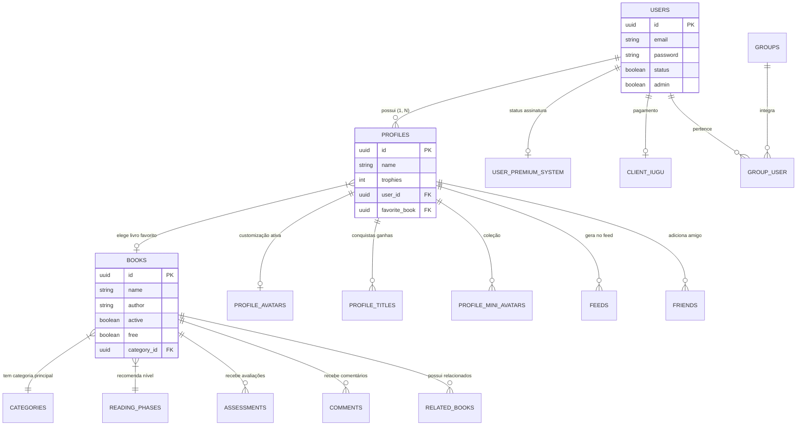

# Banco de Dados & Migrações 🗄️

Este projeto utiliza **PostgreSQL** para o armazenamento relacional e **Redis** para caching. Abaixo detalhamos a estrutura completa das tabelas, suas relações e as estruturas das entidades principais.

---

## 🗺️ Fluxograma de Dados (ER Diagram Avançado)

Abaixo apresentamos as relações de forma direcional e as principais propriedades das tabelas centrais.



---

## 🔎 Estrutura das Tabelas Principais (Core)

Para as entidades mais críticas, aqui estão as principais colunas e seus propósitos:

### Tabela: `users`
O pilar de acesso do sistema.
- `id` (uuid): Identificador único da conta.
- `name` / `email` (string): Dados de identificação do assinante/responsável.
- `password` (string): Hash criptografado (Bcrypt).
- `status` (boolean): Flag de soft-delete ou bloqueio.
- `is_email` (boolean): Confirmação de e-mail ativado.
- `admin` (boolean): Define se é um administrador global do sistema.
- `type` (string[]): Controle flexível de tipos de conta.

### Tabela: `profiles`
Cada usuário ('users') pode criar múltiplos perfis de uso (para diferentes filhos/salas).
- `id` (uuid): Identificador único.
- `user_id` (uuid): Relacionamento Foreign Key com a tabela `users`.
- `name` (string): Nome da criança/perfil.
- `birth_date` (date): Cálculo de fase de leitura ideal.
- `trophies` (int): Pontuação acumulada por leitura e gamificação.
- `favorite_book` (uuid): Foreign key opcional para a tabela `books`.
- `avatar_id_number` (int): Seed/Referência numérica rápida para avatares 2D base.

### Tabela: `books`
O catálogo central de conteúdo pedagógico/divertimento.
- `id` (uuid): Identificador único do livro.
- `name` (string): Título da obra.
- `author` / `illustrator` (string): Dados da obra original.
- `cover` / `mini_cover` (string): Links do AWS S3 contendo as imagens de capa.
- `book_link` / `epub_link` (string): Link S3 para os artefatos de leitura.
- `free` / `active` (boolean): O livro é gratuito? Ele está disponível na plataforma no momento?
- `category_id` (uuid): Associação principal para agrupamento em tela.
- `reading_phase_id` (uuid): Estágio pedagógico recomendado do livro.

---

## 📂 Visão Geral dos Módulos (Outras Tabelas)

### 👤 Customização e Elementos Visuais
- **`profile_avatars`**: Configuração visual detalhada do avatar do perfil associando chaves de olhos, bocas, cores (`avatar_colors`, `eyes`, `mouths`).
- **`profile_avatar_accessories`**: Roupas/itens equipados (`book_accessory`).
- **`titles` / `profile_titles`**: Sistema de conquistas textuais desbloqueáveis.
- **`mini_avatars`**: Colecionáveis gerados a partir do histórico.

### 🏫 Grupos (Instituições / Turmas)
- **`groups`**: Turmas escolares ou grupos familiares. Possui trava de `validity` (Validade).
- **`group_user`**: Tabela pivo conectando o professor/responsável ao grupo.

### 💳 Assinaturas Financeiras
- **`user_premium_system`**: Flag e data de validade (`expires_at`) do momento em que o assinante ainda pode acessar conteúdo fechado.
- **`cliente_iugu` / `cliente_apple`**: Logs e IDs transacionais dos parceiros de pagamento para verificação.

### ⛔ Governança e Controle
- **`logs`**: Rastreio granular de ações de administradores ou erros.
- **Tabelas de Bloqueios (Blok)**: O sistema suporta um complexo motor de restrição parental ou escolar. As tabelas `user_blok_book`, `profile_blok_category`, e `group_blok_reading_phase` servem para proibir especificamente que sub-perfis vejam certos dados.

---

## 🚀 Como Lidar com Migrações

Os artefatos que criam e atualizam estas tabelas vivem dentro de `src/shared/infra/typeORM/migrations`.

1. **Testar novas migrações localmente antes de commit.**
   ```bash
   yarn typeorm migration:run
   ```
2. **Reverter a última caso identifique erro logo em seguida.**
   ```bash
   yarn typeorm migration:revert
   ```
3. **Gerar um script de migração vazio.**
   ```bash
   yarn typeorm migration:create -n MudarColunaNovaEmProfiles
   ```

> ⚠️ **Atenção**: Uma vez que a migração foi para produção, **nunca** altere o arquivo original. Se precisar corrigir um typo ou tipo de coluna, crie uma **nova migração**.
