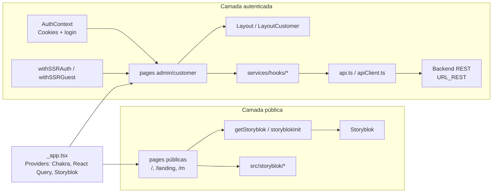

# Estrutura e Arquitetura

Este projeto é um frontend Next.js baseado em `pages`, com autenticação por cookies, estado de servidor via React Query e integração com backend REST e Storyblok.

## 🏗️ Visão geral da arquitetura

Existem dois fluxos principais dentro da aplicação:

- fluxo transacional e administrativo, que consome o backend REST via Axios;
- fluxo de páginas públicas e conteúdo, que consome Storyblok.

## 🗺️ Diagrama da arquitetura



Fluxo simplificado das páginas privadas:

```text
Página Next.js
  -> Layout / Componentes
  -> Hook de domínio em services/hooks
  -> apiClient (Axios)
  -> Backend REST
```

Fluxo simplificado das páginas públicas:

```text
Página Next.js
  -> getStoryblok / storyblokInit
  -> Storyblok
  -> Componentes em src/storyblok
```

## 📁 Estrutura de pastas

```text
src/
  components/      Componentes reutilizáveis, layout, tabelas, modais e formulários
  contexts/        Contextos globais, como autenticação e sidebar
  hooks/           Hooks simples de apoio, como autorização
  interfaces/      Tipagens e contratos do domínio
  pages/           Rotas do Next.js
  services/        Cliente HTTP, erros e hooks React Query por domínio
  storyblok/       Componentes usados para renderizar conteúdo do CMS
  styles/          Tema Chakra UI e tokens visuais
  utils/           Guardas SSR, helpers e utilitários
public/            Arquivos estáticos
```

## 🛣️ Organização das rotas

### `src/pages`

É a camada de entrada da aplicação. As rotas estão agrupadas por contexto de uso.

- rotas públicas: `/`, `/landing`, `/m`, `/success`, `/send`;
- autenticação e acesso: `/signIn`, `/new-account`, `/reset-forgot`, `/reset-password`, `/password/reset`, `/user-validate`;
- área do cliente: `/customer`, `/customer/new-plan`;
- área administrativa: `/admin` e seus módulos de usuários, livros, assinaturas, grupos, parceiros, feed, personagens e exportação;
- rotas internas da aplicação: `src/pages/api`, hoje usadas para apoio à consulta de Iugu.

## 🧱 Camadas principais

### `components`

Concentra a UI compartilhada.

- `Layout.tsx` organiza a experiência admin com `Header` e `Sidebar`.
- `LayoutCustomer.tsx` organiza a área do cliente sem sidebar lateral.
- `ModalUpdate/` concentra modais de edição e manutenção.
- `SubMenu/`, `Sidebar/` e `Header/` montam a navegação.
- `Input`, `Select`, `Checkbox`, `Textarea` e afins padronizam formulários.

### `contexts`

Os contextos globais existentes são:

- `AuthContext.tsx`, responsável por login, persistência da sessão e redirecionamento pós-login;
- `SidebarDrawerContext.tsx`, responsável por estado de abertura da navegação lateral.

### `services`

É a camada de acesso a dados.

- `api.ts` cria o cliente Axios com `baseURL` vinda de `URL_REST`.
- `apiClient.ts` adiciona tratamento de `401`, refresh token e repetição da requisição original.
- `hooks/` organiza as consultas por domínio, por exemplo `user`, `book`, `subscriptions`, `plans`, `groups`, `feed`, `avatar`.
- `queryClient.ts` centraliza o `QueryClient` do React Query.
- `errors/` reúne erros de domínio usados na camada de requisição.

### `storyblok`

Contém os renderizadores dos blocos usados nas páginas públicas. Isso separa a UI institucional do restante do dashboard e permite que o conteúdo seja gerenciado fora do código, no CMS.

### `utils`

Concentra utilitários transversais:

- `withSSRAuth.ts` protege páginas privadas no SSR;
- `withSSRGuest.ts` evita acesso às telas de autenticação quando já existe sessão válida;
- `getStoryblok.ts` encapsula a leitura de páginas do CMS;
- utilitários complementares, como formatação de data e debounce.

## 🔐 Autenticação e autorização

O login acontece por `POST /session`.

Após sucesso, o frontend grava três cookies:

- `app.token`
- `app.refreshToken`
- `app.user`

Com base em `user.admin`, o usuário é enviado para `/admin` ou `/customer`.

### Proteção de rotas

- `withSSRAuth` exige sessão válida em páginas privadas.
- `withSSRGuest` redireciona usuários já autenticados para fora das páginas de login e recuperação.
- `apiClient` intercepta `401`, tenta renovar o token e faz logout quando não consegue renovar a sessão.

## 🔄 Padrão de dados e mutações

O padrão predominante é:

1. a página consome um hook de domínio em `services/hooks`;
2. o hook executa leitura com React Query;
3. mutações usam `useMutation` direto nas páginas ou componentes de edição;
4. após salvar, o código invalida queries com `queryClient.invalidateQueries(...)`;
5. a UI mostra toasts de sucesso ou erro com Chakra UI.

Esse padrão aparece de forma consistente em telas como usuários, livros, planos e assinaturas.

## 🎨 Padrões de layout

- `Layout.tsx`: usado na área administrativa.
- `LayoutCustomer.tsx`: usado na área do cliente.
- páginas públicas não usam o mesmo shell do dashboard e podem ter identidade própria, especialmente as rotas integradas ao Storyblok.

## 🔌 Integrações externas

- Backend REST da Tecteca para autenticação e operação do sistema.
- Storyblok para conteúdo institucional e páginas públicas.
- Iugu para cobrança e consulta de faturas/assinaturas.
- Apple para visão administrativa de assinaturas do ecossistema Apple.
- HubSpot em uma rota específica de formulário/cadastro.

## ⚠️ Pontos de atenção arquiteturais

- O projeto usa Next.js 12 e Pages Router, então não segue o modelo de `app/`.
- `next.config.js` está configurado com `typescript.ignoreBuildErrors = true`, o que permite build mesmo com erros de TypeScript.
- O frontend depende fortemente do backend para regras de negócio; sem o backend, a maior parte das telas privadas não funciona.
- Há integrações sensíveis atualmente embutidas no código. Em produção, o ideal é centralizar esses dados em variáveis de ambiente.

---

← [Voltar ao README](../README.md) · Ver também: [Operações Comuns](OPERACOES_COMUNS.md)